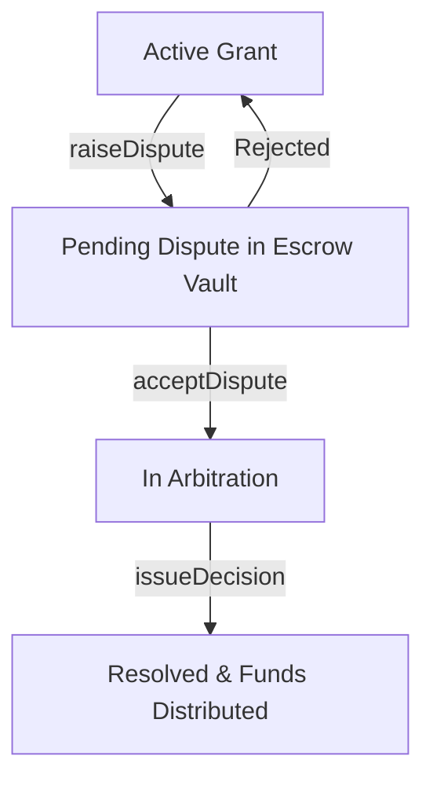
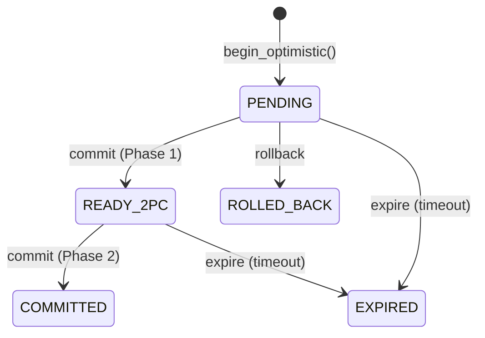

# AgriTrust Smart Contracts Documentation

Welcome to the consolidated documentation for the AgriTrust smart contracts. This document provides a comprehensive overview of the architecture, security models, and a detailed function-by-function reference for all deployed contracts.

## Table of Contents

1. [Overview & Purpose](#1-overview--purpose)
2. [Architecture](#2-architecture)
3. [Contracts Reference](#3-contracts-reference)
   - [Provenance](#provenance)
   - [State / Optimistic Mutator](#state--optimistic-mutator)
   - [Treasury / Speed Bump](#treasury--speed-bump)
   - [Vesting Contracts](#vesting-contracts)
   - [ZK KYC](#zk-kyc)
   - [Grant Stream / Yield Treasury](#grant-stream--yield-treasury)
4. [Security & Audit Notes](#4-security--audit-notes)
5. [Compliance & Integration](#5-compliance--integration)

---

## 1. Overview & Purpose
Smart contracts for managing trust streams with milestone completion proof hashing and integrated dispute resolution system on Stellar (Soroban WASM) and Ethereum/L2s (Solidity).

### Key Features
* **Per-Second Streaming Accrual:** High-precision streaming logic using scaling factors on Soroban.
* **Legal Anchoring & Escrow:** Restricts fund streaming until legal documents are cryptographically signed on-chain, alongside an integrated arbitration escrow.
* **Multi-Chain Smart Contracts:** Soroban-based smart contract implementation alongside a Foundry/Solidity implementation supporting ZK proof verification.

## 2. Architecture

### Arbitration Escrow System
The Dispute Resolution Arbitration Escrow system provides a comprehensive Web3 courtroom for high-stakes grants, ensuring that social friction is resolved through a transparent and fair legal process. When a DAO claims a project was never delivered, funds are moved to a neutral "Jury" (Escrow Vault) and can only be released via signature from pre-approved Third-Party Arbitrators.

### Optimistic Concurrency Control (2PC)
The `state` module implements an optimistic concurrency control (OCC) system for batch state transitions using a two-phase commit (2PC) protocol with per-batch sequence counters as a linearization point to prevent race conditions.

## 3. Contracts Reference

### Provenance
The Provenance contract manages trust streams and verification chains. It ensures compliance and credential validation across multiple hops.

#### `resolve`
* **Signature**: `resolve(env: Env, chain_id: BytesN<32>, hop_ids: Vec<BytesN<32>>) -> Result<ProvenanceResult, Error>`
* **Purpose**: Resolve a provenance chain and return the aggregated result.
* **Params**:
  * `chain_id`: Unique identifier for this chain resolution.
  * `hop_ids`: Ordered list of hop identifiers.
* **Returns**: `Result<ProvenanceResult, Error>` - The aggregated result.
* **Access Control**: Public.
* **Events Emitted**: `(prov, resolved)`, `(storage, warn)`.
* **Reverts**: `EmptyChain`, `ChainTooLong`, `StorageBudgetExceeded`, `HopNotFound`, `InvalidScore`, `InvalidHopSignature`, `InvalidHopCredential`.

#### `write_hop`
* **Signature**: `write_hop(env: Env, hop_id: BytesN<32>, state: HopState)`
* **Purpose**: Write a HopState into persistent storage.
* **Params**:
  * `hop_id`: Unique identifier for the hop.
  * `state`: The `HopState` to write.
* **Returns**: Void.
* **Access Control**: Public (typically called by grant_contracts, compliance, admin, treasury).

#### `get_result`
* **Signature**: `get_result(env: Env, chain_id: BytesN<32>) -> Option<ProvenanceResult>`
* **Purpose**: Retrieve a previously resolved ProvenanceResult.

### State / Optimistic Mutator
Implements optimistic concurrency control with two-phase commit.

#### `initialize`
* **Signature**: `initialize(env: Env)`
* **Purpose**: Initialize the state version to 0.

#### `begin_optimistic`
* **Signature**: `begin_optimistic(env: Env, batch_id: Bytes, state_updates: Map<Bytes, Bytes>) -> u64`
* **Purpose**: Begin an optimistic mutation. Generates `mutation_id`.
* **Params**: `batch_id`, `state_updates`
* **Returns**: `u64` (sequence number)
* **Events Emitted**: `(begin_opt, batch_id, mutation_id)`

#### `commit_optimistic`
* **Signature**: `commit_optimistic(env: Env, batch_id: Bytes, mutation_id: Bytes) -> bool`
* **Purpose**: Commit an optimistic mutation using 2PC.
* **Returns**: `true` if committed, `false` if compensated/expired.
* **Events Emitted**: `(committed, batch_id, mutation_id)`, `(compense, batch_id, mutation_id)`, `(expired, batch_id, mutation_id)`

#### `rollback_mutation`
* **Signature**: `rollback_mutation(env: Env, batch_id: Bytes, mutation_id: Bytes)`
* **Purpose**: Rollback a pending mutation with compensation logging.
* **Events Emitted**: `(rolledbk, batch_id, mutation_id)`

#### `expire_pending`
* **Signature**: `expire_pending(env: Env, batch_id: Bytes, mutation_id: Bytes) -> bool`
* **Purpose**: Expire a pending mutation after timeout. Anyone can call.
* **Events Emitted**: `(expired, batch_id, mutation_id)`

### Treasury / Speed Bump
Handles delayed high-value transfers (Speed Bump).

#### `initialize`
* **Signature**: `initialize(env: Env, admin: Address, token_contract: Address, treasury_balance: u64)`
* **Purpose**: Initialize treasury parameters.
* **Access Control**: Admin only.

#### `approve_transfer`
* **Signature**: `approve_transfer(env: Env, admin: Address, recipient: Address, amount: u64) -> bool`
* **Purpose**: Approve transfer. Exceeding 10% threshold queues with 72h delay. Otherwise executes immediately.
* **Returns**: `bool` (true if executed immediately).
* **Access Control**: Admin only.

#### `execute_transfer`
* **Signature**: `execute_transfer(env: Env, caller: Address, transfer_id: u64)`
* **Purpose**: Execute queued transfer after 72h window.
* **Access Control**: Admin only.
* **Reverts**: If vetoed, window not passed, or ID not found.

#### `veto_transfer`
* **Signature**: `veto_transfer(env: Env, admin: Address, transfer_id: u64)`
* **Purpose**: Veto pending transfer during 72h window.
* **Access Control**: Admin only.

### Vesting Contracts
Manages vesting schedules and cliff adjustments.

#### `create_vesting_schedule`
* **Signature**: `create_vesting_schedule(env: Env, grant_id: BytesN<32>, total_amount: i128, start_time: u64, end_time: u64) -> BytesN<32>`
* **Purpose**: Creates a new vesting schedule.
* **Events Emitted**: `(vesting_created, grant_id)`
* **Reverts**: `InvalidAmount`, `InvalidSchedule`, `ScheduleAlreadyExists`

#### `read_vesting_schedule`
* **Signature**: `read_vesting_schedule(env: Env, grant_id: BytesN<32>) -> VestingSchedule`
* **Purpose**: Retrieve existing vesting schedule.
* **Reverts**: `ScheduleNotFound`

#### `migrate_legacy_vesting_schedule`
* **Signature**: `migrate_legacy_vesting_schedule(env: Env, grant_id: BytesN<32>) -> BytesN<32>`
* **Purpose**: Migrate old legacy storage keys to new format.

### ZK KYC
Verifies user identity via zero-knowledge proofs.

#### `init`
* **Signature**: `init(env: Env, verifier: Address)`
* **Purpose**: Initialize the verifier address.

#### `verify_user` / `revoke_user`
* **Signature**: `verify_user(env: Env, user: Address)` / `revoke_user(env: Env, user: Address)`
* **Purpose**: Set/remove KYC status.
* **Access Control**: Verifier only.

#### `submit_proof`
* **Signature**: `submit_proof(env: Env, identity_commitment: BytesN<32>, domain_id: BytesN<32>) -> BytesN<32>`
* **Purpose**: Submit ZK-KYC proof for a specific domain. Derives nullifier.
* **Events Emitted**: `(nullifier, domain_id, nullifier_hash)`
* **Reverts**: Domain not registered, proof replay detected.

#### `register_compliance_domain`
* **Signature**: `register_compliance_domain(env: Env, domain_id: BytesN<32>)`
* **Purpose**: Authorize a domain for ZK proofs.

### Grant Stream / Yield Treasury
Manages complex grant streams, milestone submissions, disputes, and yield treasury integrations. *(Note: Many behaviors lack explicit NatSpec and are flagged as ambiguous).*

#### Core Grant Operations
* **`create_grant(env: Env, ...)`** / **`create_confidential_grant(env: Env, ...)`**: Creates a standard or confidential grant stream.
* **`withdraw(env: Env, grant_id: u64, amount: i128) -> Result<(), Error>`**: Withdraw claimable funds.
* **`claimable(env: Env, grant_id: u64) -> i128`**: Calculates current claimable amount.
* **`cancel_grant(env: Env, grant_id: u64) -> Result<(), Error>`**: Cancels an active grant.
* **`change_grantee(env: Env, grant_id: u64, new_grantee: Address) -> Result<(), Error>`**: Updates the grantee address.
* **`pause_stream`** / **`resume_stream`** / **`emergency_pause`**: Controls streaming state.

#### Disputes & Clawbacks
* **`trigger_grant_clawback`**: Initiates a clawback of unvested funds.
* **`trigger_grant_dispute(env: Env, grant_id: u64) -> Result<(), Error>`**: Pauses stream and enters dispute state.
* **`resolve_disputed_clawback`**: Resolves an active dispute.
* **`get_dispute_escrow_balance(env: Env, grant_id: u64) -> Result<i128, Error>`**: Gets funds held in escrow.

#### Milestones & Legal Anchoring
* **`set_legal_metadata`** / **`sign_legal_metadata`**: Associates and signs legal agreements on-chain.
* **`submit_milestone_proof`**: Submits a milestone proof hash.
* **`approve_milestone_submission`**: Approves a milestone.
* **`slash_ms_submission_deposit`**: Slashes deposit if milestone rejected.

#### Security Council & Rescue
* **`initialize_security_council`** / **`create_timelocked_action`** / **`execute_timelocked_action`**: Multisig timelock for protocol upgrades/actions.
* **`propose_rescue`** / **`approve_rescue`** / **`execute_rescue`**: Emergency token recovery mechanics.
* **`protected_clawback`** / **`execute_protected_clawback`**: Timelocked clawback mechanism.

#### Yield Treasury Operations
*(From `yield_treasury.rs`)*
* **`invest_idle_funds`** / **`divest_funds`**: Move funds to/from yield-generating strategies.
* **`get_yield_position(env: Env)`** / **`get_yield_metrics(env: Env)`**: Retrieve yields generated.
* **`harvest_yield(env: Env)`**: Reinvest or claim accrued yield.
* **`emergency_withdraw`**: Pull funds from strategy in an emergency.

## 4. Security & Audit Notes
The security architecture employs multiple layers to protect high-stakes grants.

### Trust Boundaries & Access Control
- **Admin**: Full protocol control (god-mode). Protected by multi-sig (e.g., 2-of-3), HSM/MPC custody, and time-locks.
- **Oracle**: KPI multiplier updates. Bounded by deviation limits and sanity oracles.
- **Recipient**: Can only withdraw own claimable funds and trigger recipient-scoped actions like rage-quit.

### Threat Model & Mitigations
* **Admin Key Compromise**: Mitigated by multi-sig, HSM, off-chain approval workflows, and emergency admin rotation.
* **Oracle Manipulation**: Mitigated by price deviation checks, sanity oracles, and heartbeat monitoring.
* **Reentrancy**: Mitigated by manual guards (`reentrancy_enter`) that use temporary storage locks.
* **Circuit Breaker Bypass**: Mitigated by TVL velocity limits (20% drain in 6 hours triggers a soft pause).
* **Double-Approval Bypass**: High-value payouts require separate approver roles and time windows.

### Audit History
* **[AUDIT-001] Zealynx (2024-Q1)**: Core protocol. 3 findings (Resolved).
* **[AUDIT-002] Trail of Bits (2024-Q2)**: Reentrancy. 1 finding (Resolved).
* **[AUDIT-003] ConsenSys (2024-Q3)**: Circuit breakers. 2 findings (Resolved).
* **[AUDIT-014] OpenZeppelin (2024-Q4)**: Full protocol. (In Progress).

## 5. Compliance & Integration

### On-Chain Compliance Officer
To meet regulatory requirements for institutional grants, the protocol implements a restricted "Read-and-Pause" compliance role.
* **Capabilities**: Can pause streams and flag addresses based on sanctions matches or suspicious patterns. Can unpause and read all data.
* **Restrictions**: Cannot redirect or steal funds, change protocol parameters, or access treasury funds.
* **Reason Codes**: `1` (Sanctions Match), `2` (Suspicious Activity), `3` (Regulatory Review).
* **Safeguards**: Maximum pause duration is configurable (e.g., 30 days) and there is a minimum 1-hour unpause delay.

### Governance Activity Monitor
A circuit breaker to protect against rapid parameter changes. 
* **Mechanic**: If an admin attempts to change >3 protocol parameters in a single ledger, a mandatory 7-day timelock is enforced.
* **Integration**: Admin functions wrap their logic with `GovernanceActivityMonitor::record_parameter_change`.

### Legal Anchoring
* **Document Hashing**: Legal documents are stored as CIDs on-chain. Signatures are strictly required before any streaming begins.
